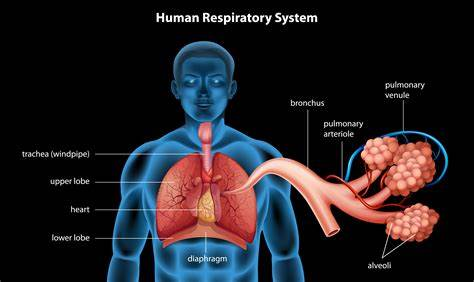
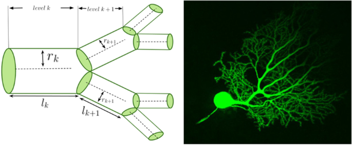
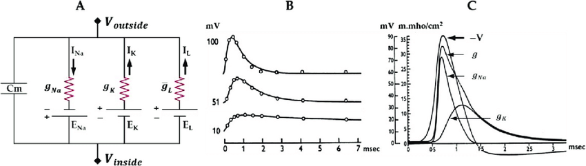
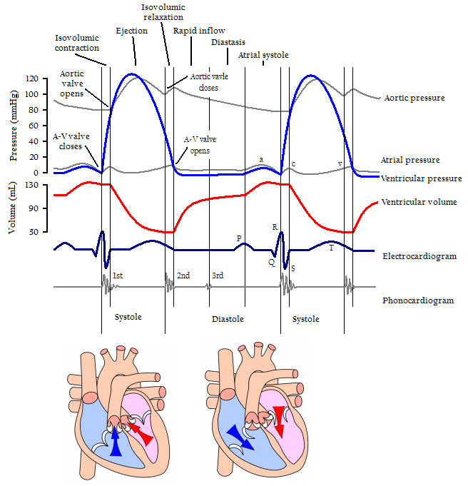

# 🧬 Modeling and Analysis of Physiological Systems

Welcome to the repository dedicated to the modeling and analysis of physiological systems! This collection features several projects that utilize MATLAB, Simulink, and CricAdapt to explore various aspects of human physiology. Each project offers unique insights into the complex functions of the human body. Below, you'll find details on a few key projects along with instructions on how to use them.

## 🔑 Key Projects

### 🫁 Respiratory System Simulation

**Explore the mechanics of breathing by simulating various respiratory conditions with MATLAB.** This project demonstrates how normal, restrictive, and obstructive pulmonary diseases affect respiratory dynamics. Visualize changes in minute ventilation and understand the physiological impacts of different respiratory conditions.

### 🌳 Dendritic Tree Modeling with Branched Cylinders

**Model the electrical properties of dendritic trees by approximating them as branched cables.** MATLAB simulations help illustrate the behavior of axonal and dendritic trees, providing insights into how these structures contribute to physiological signaling processes.

### ⚡ Hodgkin-Huxley Model for Nerve Action Potentials

**Analyze nerve cell action potentials using the Hodgkin-Huxley equations.** This project covers various aspects, including threshold behavior, refractoriness, and the influence of temperature. MATLAB is used to simulate these dynamics, offering a detailed view of action potential behaviors under different scenarios.

### ❤️ Cardiac Function Analysis

**Investigate the complexities of heart function using simulation tools.** This project examines normal sinus rhythm, blood flow velocities, and pressure-volume relationships, among other cardiac dynamics. By studying valve movements and diastolic filling phases, you can gain a deeper understanding of the heart's physiological processes.

## 🛠️ How to Use

1. **Clone the Repository:** Download the repository to your local machine.
2. **Select a Project:** Navigate to the directory of the project you wish to explore.
3. **Follow Instructions:** Each project includes a README with specific instructions for running simulations.
4. **Explore and Modify:** Use the provided MATLAB scripts, Simulink models, and documentation to delve into the physiological concepts and experiment with the simulations.

## ⚠️ Disclaimer

The simulations provided here are for educational purposes only and are not intended to replace professional medical advice. They are designed to offer a practical understanding of physiological systems through computational models.

Feel free to use, modify, and learn from these simulations to enhance your educational experience.
